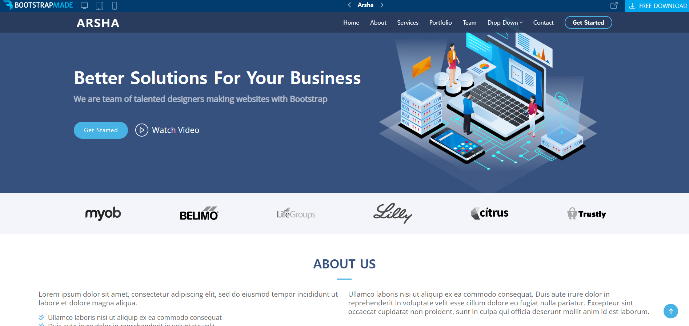

# AnJeonggeun

### 👋 피로그래밍 19기 안정근의 저장소입니다.

- 첫번째 과제 - github 웹사이트 구현하기  
  😱 첫 과제부터 새벽 3시 마감이라니 앞으로가 기대가 됩니다...
  

- 두번째 과제 - bootstrap으로 클론 코딩하기  
  😓 위치 조정, 크기 조절을 css 없이 하려니 생각보다 오래 걸렸습니다.
  

    
구현 png

    
    
  

- 세번째 과제 - Arsha 팀프로젝트  
  😂 기능 구현보단 github, gitkraken에 익숙해지는 데에 집중했습니다. merge conflict 해결 쉽지 않네요...
  

- 네번째 과제 - 스탑워치
  😀 지옥주가 지나간건가요! 앞의 과제들보다 빠르게 끝나서 좋네요!
  querySelector를 사용하는 이유를 알 수 있었습니다.
  
