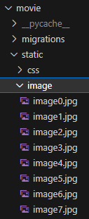

구현한 기능: 1,2,3,4,5,6,7,8,9,10,11

구현하지 못한 기능: X

🔥 챌린지 참여합니다! 🔥

- 프론트는 예시를 참고하여 구현하였습니다.  
  👻 ~~백엔드 지망생입니다~~

1️⃣ 장르 선택

- select 태그를 이용하여 구현하였습니다.
  ```
  <select name="genre">
      <option value="none">---------</option>
      <option value="액션">액션</option>
      <option value="범죄">범죄</option>
      <option value="SF">SF</option>
      <option value="코미디">코미디</option>
      <option value="멜로/로맨스">멜로/로맨스</option>
      <option value="스릴러">스릴러</option>
      <option value="공포">공포</option>
      <option value="드라마">드라마</option>
    </select>
  ```
- 다른 input 태그와 마찬가지로 선택된 option의 value가 문자열로 전달됩니다.
  ```
    genre = models.TextField()
  ```

<br/>
2️⃣ 분 단위 입력을 시간 단위로 변환되어 출력

- view 의 각 함수에서 변환하여 템플릿에 데이터를 전달하는 방식으로 구현하였습니다.

  ```
  def movies_read(request, pk, \*args, \*\*kwargs):
    movie = Movie.objects.get(id=pk)

    movie_rt = movie.running_time
    hour=str(movie_rt//60)
    minutes=str(movie_rt%60)
    movie_rt=hour+'시간 '+minutes+'분'

    return render(request, "movie/movies_read.html", {"movie":movie, "movie_rt":movie_rt})
  ```

  <br/>

3️⃣ 정렬 기능

- POST 형식으로 form 에서 데이터를 받아왔습니다.

  ```
  <div id="movie_order">
    <h3>정렬 기준 선택 :</h3>
    <form action="/" method="post">
      
      <div>
        <input type="radio" name="direction" id="up" value="오름차순" checked />
        <label for="up">오름차순</label>
        <input type="radio" name="direction" id="down" value="내림차순" />
        <label for="down">내림차순</label>
      </div>

      <div>
        <input type="submit" name="order" value="영화제목 순" />
        <input type="submit" name="order" value="개봉년도 순" />
        <input type="submit" name="order" value="별점 순" />
        <input type="submit" name="order" value="러닝타임 순" />
      </div>
    </form>
  </div>
  ```

  - POST로 받아온 이유는 리스트 페이지 접근과 form을 통한 접근을 구분하기 위해서입니다.

    <br/>

- 정렬 기준에 따라 order_by() 로 정렬하였습니다.

  ```
  def movies_list(request, *args, **kwargs):
    sort=""

    if request.method == "POST":
        movie_order=request.POST["order"]
        order_direction=request.POST["direction"]
        if order_direction=="내림차순":
            sort="-"
        if movie_order=="영화제목 순":
            sort+="title"
        elif movie_order=="개봉년도 순":
            sort+="release_year"
        elif movie_order=="별점 순":
            sort+="star"
        elif movie_order=="러닝타임 순":
            sort+="running_time"

    if sort!="":
        movies=Movie.objects.all().order_by(sort)
    else:
        movies=Movie.objects.all()

    return render(request, "movie/movies_list.html", {"movies": movies})
  ```

| 원래  에서 dictsort 기능을 사용하려 했는데 사람들이 안쓰는 이유가 있는 것 같습니다..😞

4️⃣ 정적 이미지 추가

- model이 create() 될 때 자동으로 save() 가 호출되는 것을 이용하였습니다.

  ```
  class Movie(models.Model):
    .
    .
    .

    image=models.IntegerField(null=True)
    def save(self, *args, **kwargs):
        if not self.image:
            self.image=random.randint(0,7)
        super().save(*args, **kwargs)

    .
    .
    .
  ```

- 0~7 중 랜덤으로 image 정수를 부여받습니다.
- static/image에 정적 이미지들을 번호를 매겨 저장하였습니다. (image0, image1, ...)  
  
- html 에서 이미지의 경로에 이미지의 번호를 model 변수로부터 가져와서 지정하였습니다.
  ```
  
  ```
- 이 작업을 통해  이 settings.py 에서 설정한 static 파일 경로를 가져온다는 것을 이해할 수 있었습니다!
- 다음에는 이미지 업로드도 도전해보겠습니다!👊
