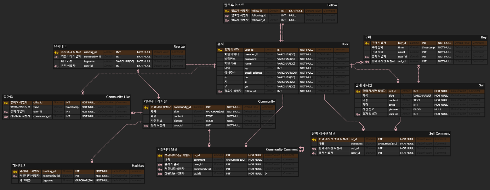
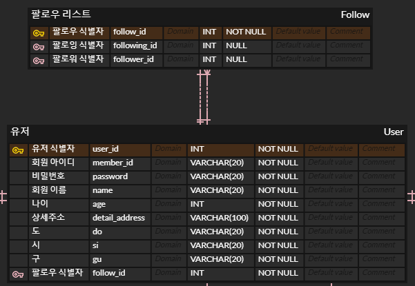

| https://www.erdcloud.com/d/vSCfm7zBm9gxSn7Ap

🔥 추가 챌린지

1️⃣ 주소를 상세주소로 바꾸기 🏢

- 원래 도, 시, 구를 엔티티로 분리하여 여러 key 값들 중 하나를 선택해야하나 고민했습니다.
- 그러나 오히려 DB 크기가 커져 자원 낭비가 되고 여러 key 값 중 하나만 선택하는 방법도 없는 것 같아서 단순히 유저 엔티티에 여러 key를 추가하였습니다.

2️⃣ 대댓글 기능 추가

- 엔티티를 추가하는 것보다 기존 댓글 엔티티를 재활용하여 상위댓글 id를 사용하도록 key를 추가하였습니다.
- 제일 상위의 댓글의 경우 그보다 더 상위인 댓글은 존재할 수 없으므로 default value를 0으로 설정하여 상위 댓글이 없음을 표시하게 하였습니다.

3️⃣ 해시태그 기능과 유저태그 기능

- 해시태그

  - 태그이름이 조금이라도 다를 경우 다른 메타데이터를 참조한다고 생각합니다. 그러나 태그이름이 바뀔 수 있으므로 super key가 될 수 없습니다.

- 유저태그
  - 해시태그와의 차이점은 유저 id를 추가로 key로 받는다는 것입니다.
  - 불특정 다수인 one이 아닌 one only인줄 알았지만 태그이름이 바뀌면 다른 유저를 가리키므로 one으로 수정하였습니다.
  - one 과 one only 차이가 제가 이해한게 맞는지 아리까리하네요..😓

4️⃣ 팔로우 기능

- 굉장히 고민을 많이 했던 설계였습니다.
- 결국 최종적으로 팔로우 리스트 엔티티를 만들고 유저가 하나의 팔로우 리스트를 가지는 것으로 설계해보았습니다.
- 팔로워와 팔로잉이 아예 없는 경우도 있으니😢 NULLABLE로 설정하였습니다.
  
- 팔로잉과 팔로워의 경우 팔로우 리스트가 여러 유저들의 키를 가지는 다(유저) 대 일(팔로우 리스트)가 맞다고 생각하지만 허용해주지 않는 것 같네요😂😂
